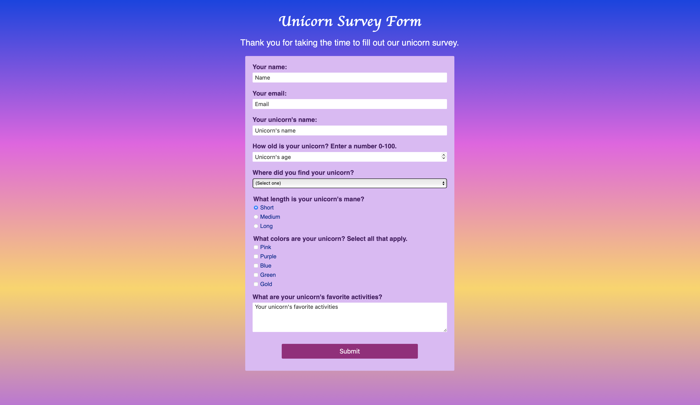

# Unicorn Survey Form
This project is a responsive and accessible survey form that features a fun unicorn theme to showcase both creativity and front-end development skills.

## Features:
- Fully responsive
- Semantic HTML
- Custom CSS
- Accessible, including proper HTML formatting and color contrast ratios that meet WCAG requirements
- Fun unicorn theme
- User-friendly layout

## Technologies Used:
- HTML5
- CSS3

## Preview

## Acknowledgements
This survey form project was built as part of the [freeCodeCamp](https://www.freecodecamp.org/learn/full-stack-developer/) Certified Full Stack Developer Curriculum.

## License
MIT